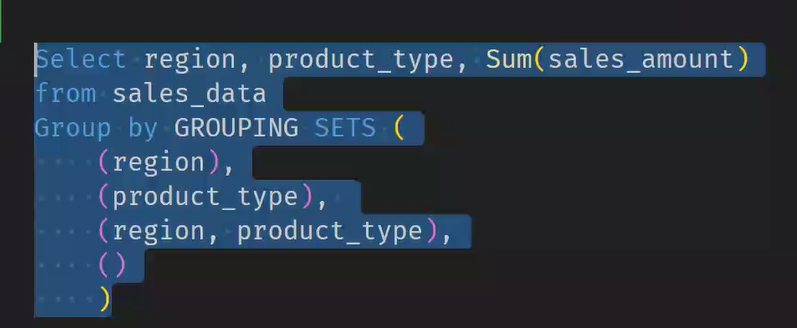
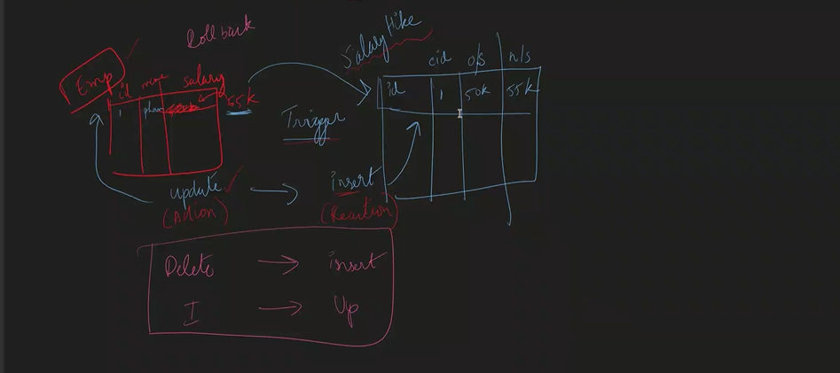

# SQL

## Database

- Database is a special software used to store the data
- cloud is a renting pc's it will rent systems only
- why renting is better than buying servers or cloud db
  - high intial cost
  - Rent room
  - A/C are required for cooling purpose
  - electricity bill
  - Maintance
  - Spares
  - Generators if power is lost
- this are the disadvantages casued to maintain servers or dabatabes ourselves

- Disaster management - to how prevent the servers from the disasters
  - place the servers in the safe palce where disasters won't happen much lis floods,tsunami,earthquakes
  - backup
- Linux is used as an operaring system in cloud because it is
  - free
  - open source
  - secure
  - smaller footprint - for installing the linux it takes 256-512 Mb which makes lesser money
  - Automation

## Scaling

- vertical Scaling -- increasing the ram or cpu's upgrade making powerfull the system so that more people can access

- horizantal Scaling -- here system power is not increased ,just use multiple systems

- Auto Scaling -- will use the extra system accordingly as load increases extra pc or systems increases and rent will be paid for the usage and decreses as well accordingly.
- making autoscaling switch on 24/7 then the compitators company will sends the fake traffic which makes that company to pay more rent which cause them bankrupt.

- solution --- change the direction of the traffic i.e change the fake traffic directions.

## Why Database

- for fast searching because in system if the data is stored and then to fetch that data if the data is in RAM then it will give the results and if the data is not in RAM then it will search in HDD and give it to the user which increases the time thats why the database a special software is used.
- If we want to search for a particular line using explorer it is difficult to search thats why database is used.

## features of Database

- Database --- frequently asked it will have it in RAM
- Querying becomes easier
- CRUD - easy
- Backups are inbuilt
- UNDO -easiy(time limit)
- Performance

### Sql Vs NoSql

- sql stores the data in tabular format

  ex: MySql,PLSql(oracle),PostgreSql,Amazon RDS

- NoSql stores the data in documents

  ex: Dynamo DB,Mongo DB,Firebase,Redis,Couch DB,cassanadra.

- redis is used for fast retirveal i.e catch but used with another database.

## Normalization

- to increase the security normalization is used.
- managing the data will be easy work will be decreased.
- messing of data is reduced.

### 1NF

- rules of 1NF

  

### 2NF

- non key values should depend on entire combined primary key.
- it should be in 1NF and 2 NF.
- upadating will be decreased.

### 3NF

- reduce the dependencies
- decreases the upadates times
- here in the below table two upadatesare required so reduced it to one update so the coloum is dependent on the intercolumn so that coloumn is deleted so that the coloumn is deleted. and in the new table the data is not much dependent i.e it means the data is upadated only once.
- Every non-key attribute in a table should depend on the key,the whole key,and nothing but primary key. ANd primary key should be also depend on the primary key


## Joins

- Joins is used to get the results from the normalized tables.


- inner join : It will get the common items of a and b.

- outer join : It will get the non common items.
- left join : It gives common items of a & b and extra items of a.
- Right join : It gives common items of a & b and extra items of b.

* joining primary key= foriegn key.


## Aggregation Functions

-

## Data types

- Integer, Boolean -- to represent the data in numerical format this integer is used . and boolean is used to represent 0 & 1.

- float -- it can store upto three decimal points(precison points).
- Character(num_chars) -- to store few characters.
- varchar(num_chars) -- to store certain sentences to certain length.
- Text -- to stor sentence and paragraphs.
- date,DateTime -- to store date and time it is used.
- Blob -- to store the images and videos in the database this blog datatype is used.

- Integer
  - int(-2b,2b)
  - small int(-32k,32k)
  - big int(-9X10^8 , 9X10^8)
- String

  - var char
  - nvarchar -- follows unicode(caluclations are easier that is chinese character is stored in unicode) supports differnet language.

- Decimal

  - decimal (exact)

    ex: decimal(10,2) -- 632.25

  - float (approx)

## Constriants

- Primary key -- the coloum which is marked as primary will not allow duplicate data or records,and will not accept the not null values.
  - single row in the table
- Autoincrement -- the integer values automatically filled in and incremented in each row insertion. not supported in all database.
- unique -- the values in the coloumn should be unique so that you can't insert another row with the same value in this coloumn as another row in the table.
- Not Null -- inserted value should not be null.
- check -- to test the inserted values are valid.
- foriegn key --

# Functions

## String Functions

1. length

   ```sql
   sytnax : select len('sumanth'); as col_name;
   ```

2. Left : gives the charcters of the string from left

   ```sql
   syntax: select LEFT('sumanth',2) as coloum;
   <!--  it requires two arguments string,number -->
   ```

3. Right : gives the charcters of the string from Right

```sql
select Right('sumanth',2) as coloum;
```

4. upper case : upper key word will give the string in upper case

```sql
synatx: select upper('sumath') as coloum;
```

5. lower case : lower key or function will give the string in lower case i.e it will convert the uppper case string to the lower case

```sql
syntax: select lower('sumath') as coloum_name;
```

6. substring : will print the substring from the start index and length (starts from 1)

```sql
syntax: select from substring('sumanth',3,5) as coloumn_name;
```

7. ltrim : to trim a string from left and also useful to remove the characters from the string

```sql
select LTRIM('sumanth','sum')//anth trims the characters from the left only
select ltrim('   sumanth')// sumanth
```

8. Rtrim : to trim a string from right and also useful to remove the characters from the string from right side only.

```sql
select rtrim('sumanth','anth')//sum
 select RTRIM('sumanth          ')//sumanth
```

9. concat: it will concatinate the each string

```sql
select CONCAT('sum','anth')// sumanth
```

10. Replicate : will print a string as many times as user give the input

```sql
select replicate('sumanth',2)//sumanthsumanth
```

11. Replace : replaces a character with another character or even a string also

```sql
select REPLACE('sumanth','ant','nth') //sumnthh
```

12. reverse : it will reverse the string

```sql
select reverse('sumanth')
```

## Arthematical functions

- 1. Abs : will print the absolute value of the value
  ```sql
  select
  ```

## DDL- Data Definition Language

create table Customers(CustomerId int,CustomerName varchar(20), Address varchar(20));
insert into Customers values
(201, 'Acme Corp','123 Main St'),
(202, 'Globex Inc''456 Elm St'),
(203, 'Initech' '789 Oak St');

## foriegn key errors

- if we want to delete a coloum then then it will shows the error because tis data is in another table thats why it show the error.

- if we want to insert an row in a foriegn key table it shows the error because it should be added first in primary key.

- we mention the "constraints" key word in the alter table then for future changes this constarint will be helpful.
- to change or update the foreign key data we use alter table query.

```sql
alter table table_name
add constriant name_len  check(len("name")>3);
```

<<<<<<< HEAD

# group by clause

- group by
- multiple group by
- grouping sets- it does'nt worry about the order of the coloumn
  

```sql
select
```

## rollup & cube

- rollup and cube is similar to grouping sets
- rollup: it will do group of region,(producttype,region),null
- cube : it will give all the possible combination.
  

## Rank-dense,row


- partition will not summerize the data while grouping will do it.

```sql
select region,product_type,sum(sales_amount),
rank() over(partition by region order by descproduct_type)
from sales_data
```

=======

> > > > > > > sql_trans

# Constraints

- check

```sql
alter table actor
add constraint  name_len  check(len("name")>3);
```

- not null

```sql
Create table Director(
DirectorId int identity(1,1) primary key ,
Name varchar(20) Not Null,
);
```

- unique
- primary key
- foreign key

```sql
alter table movieactor
add actor_id int,
constraint fk_actor foreign key (actor_id) references actor(actor_id);
```

```sql
create table movieactor
(movie_id int , actor_id int ,
constraint pk_movieactor primary key(movie_id,actor_id),
constraint movieactor_FK1 foreign key(movie_id) references movie(Movies_id),
constraint movieactor_FK2 foreign key (actor_id) references actor(Actorid));
```

- auto increment

```sql
create table movie
(Movies_id int identity(1,1) primary key,
Title varchar(30) unique,
year int not null ,Director_id int foreign key references director);
```

# Other joins

- self join
- normal join
- equi join
- cross join [matrix multiplication format]

<<<<<<< HEAD

## correlated queries:

- when inner table has the connection with the outer table then this correlated is used.
- Subqueries are not executed repeatedly once for each row (especially in the case of the WHERE clause) while correlated subqueries are executed repeatedly once for each row.
-

=======

> > > > > > > sql_trans

# XML - auto,path

```sql
//automatically convert the sql table into xml format
select *from table_name
for xml auto
```

```sql
select *from table_name
for xml path
```

```sql
select *from movie for xml path('movies');
select *from movie for xml path('movie') ,root('movies');
```

- if we want to give an attribute in the xml then use

```sql
select movie_id as [@movieID],title,director
from movie
for xml path('movie') , root('movies');
```

- using [movieinfo/coloumn_name] it will creates a nested xml

```sql
SELECT

	MovieId as [@MovieId], -- attribute [xml auto will give attribute]
  -- path will give

	Title as [MovieInfo/Title], -- nesting xml

	[Year] as [MovieInfo/Year],

	DirectorId

FROM Movies

FOR XML Path ('Movie'), Root('Movies')
```

## json

```sql
select *from movie for json path,root;
```

```sql
select movieId as [id] ,title as 'movieinfo.title'
[year] as 'movieinfo.year' from movie for json path,root('movies');
```

## keys in sql


- candidate key : the coloumns which are elgible to become priamry key is called priamry key

- alternate key - the key which can be an alternative to the primary rows then it is called an alternate key.

- super key : a group of single or multiple keys which identifies rows in table.

-

## joins -cross,natural,equi

```sql

select *from table1 cross join table2 order by col1_name;
```

```sql
select *from table1 natural join table2 ;
```

```sql
select *from table1 equi join table2 coloumn_name;
-- it is same as inner join like replace of "inner and on ="
```

## cast && convert

```sql
select CAST(25.6 as int) as coloumn; -- same it will also used for format
select CONVERT( int,25.6) as coloumn; -- both are same but it can be used for styling code [format]
select convert( binary,2);
select CONVERT(varchar,getdate(),101);
select CONVERT(varchar,getdate(),111);
```

## Declaring a Variable

```sql
Declare @movie_id int;
set @movie_id =3
select *from movies moviesId=@movie_id;
```

# Function

- To create our own method and using that function .Functions are used.
- instead of aggregate functions we can create our own aggregate fucntion.

1. scalar means returns single value wether int,float,date..etc

```sql
create function dbo.CalculateMovieAge(@movieid int)
returns int--scalar methond
as
begin
return year(getdate())-(select ReleaseYear from movies where MovieID=@movieid);
end;
select dbo.CalculateMovieAge(1);
```

2. ITVF-INLINE

```sql
create function dbo.calculateAge(@releasedate int)
returns int
as
begin
return year(getdate())-@releasedate;
end;

select dbo.calculateAge(2000);
```

3.MTVF

- In mtvf there is a possible to insert,update,delete,change but on a same table.

```sql
Create Function dbo.GetMoviesAfter2015()
Returns @LatestDecadeMovies Table(Title varchar(100), ReleaseYear Int, Genre varchar(20))
As
Begin
	Insert Into @LatestDecadeMovies
	Select Title, ReleaseYear, Genre  from Movies where ReleaseYear > 2015

	-- updates

	-- delete
	Return;
End

Select * from dbo.GetMoviesAfter2015()
```

## Replace off limit,offset in sql server

```sql
select *,dbo.calculateAge(year) as age_of_movie from movie
--where dbo.calculateAge(year) <9
order by age_of_movie desc
offset 3 rows
fetch next 3 rows only;
```

- to fetch for top 3 rows :

```sql
select top(3)*,dbo.calculateAge(year) as age_of_movie from movie
--where dbo.calculateAge(year) <9
order by age_of_movie desc;
```

# Views

- its looks like a table but it is not a table.
- also called demo table.
- if we change the main table than the view table will also changes.
  Pros:

1.  complex statement - create view - easy readablity[hidhing the complexity code]
2.  Abstraction
3.  security

    Syntax :

```sql
create view viewtable1
 as
 select *,dbo.calculateAge(year) as age_of_movie from movie
--where dbo.calculateAge(year) <9
order by age_of_movie desc
offset 3 rows
fetch next 3 rows only;

select *from viewtable1;
```

# Store Procedures

- there are limiations in funcitons like we can't access the tables which are not mentioned in the function
- But using the store procedures we can able to do that

```sql
declare @orderamount decimal(10,2) =1500.00
if @orderamount>1000
begin
print 'Applying 10% discount'
end
else
begin
print 'NO Discount'
end
```

```sql
declare @counter int =10
while @counter>0
begin
print @counter
set @counter = @counter-1
end
```

```sql
create procedure spd
    @genre nvarchar(20)
as
begin
select * from Movies
where Genre=@genre;
end

exec spd  'Romance'
execute spd 'Drama'
```

# Indexing

- it will store the id using the priamry keys only because of it uniqueness.
- indexing will perform grouping to store the data.
- similar to binary search it will perform grouping.

](image-12.png)

- insertion and reading are vice -versa as reading becomes faster insertion become slow.


<<<<<<< HEAD

# clustered index

=======

## clustered index

> > > > > > > sql_trans

1. primary key
2. decide table order
3. only one per table

```sql
Create Clustered Index IX_tblEmployee_Gender_Salary
ON tblEmployee(Gender DESC, Salary desc)
-- to create  our own clustered index by using the above command we can create the default index for the table.
drop index IX_tblEmployee_Gender_Salary on tblemployee;
-- To drop that index use the above command.
```

<<<<<<< HEAD

# non clustered

=======

## non clustered

> > > > > > > sql_trans

1. non primary key
2. not decides table order
3. many per table

```sql
create nonclustered index exe on  employees(name desc);
``
```

- insertion and updation will beomce slow because of the indexing is in non clustered order so that it will become slow .becasue in background the sql has to insert in the many tables but compared to updation the updation will be a little slow while compared to the insertion.

- But Deletion will be slower because it needs to delete in more tables because the sql will has to delete the data in the background in many tables


<<<<<<< HEAD

## Differnece between clustered and non-clustered index

- Clustered index will divide the table index into subtree's.
- If we want to find a record using the clustered index then first it will check the value position based on the sub tree's it will divide and search so the finding will be a little bit faster.
- While compared to the non-clustered indexing based on the indexed coloumn it will creates the another table backgrroung and the it will helps to find the record in less amount of time while compared to the clustered index.

## Why the indexing is bad??

- Reindexing will be the problem after insertion is happened which will increases the cost.
- delete and insertion is slower.
- but updation will become fast.

# filtered index

- filtering the rows on the coloumn which is released in the year 2020.

```sql
create index ix_filtered_year
on movies (title)
where releaseyear=2020
```

## enabling and disabling of index

```sql
alter index index_name on table_name disable\rebuild;
```

## Renaming query

```sql
exec sp_rename 'movies.ix_filtered_year','Ix_movie-filter_year'
```

=======

> > > > > > > sql_trans

## Unique Vs Non-Unique

unique index means applying unqiue on the unique column
where as non- unique is on the non unique columns.

# ACID-Properties

- Atomicity :

  - the transactions should be either complete or totally unsuccessful.
  - it should not stop in between the transaction.
    
  - both updation and insertion should be happend in both the tables accordingly. or else nothing should be happen.
  - either both should pass or both should fail.
  - For this "rollback" is supposed to be used.

- Consistency :

  - cannot have ghost data.
  - something should be accounted.
    if a transaction is happend somewhere it has to be reduced and somewhere it has to be added.

- Isolation

  - the particular row should be blocked until the transaction is completed.
  - the example for the isolation is movie seat booking.
  - until user completes a transaction the row or seat should be locked and cannot be affected by another users.

```sql
begin transaction
update actors
set FirstName ='prabhask'

<<<<<<< HEAD
where ActorID=11
=======
where ActorID=5
>>>>>>> sql_trans

commit transaction

select *from Actors -- isolation ❌
select *from Actors where ActorID=5 --❌ won't execute until the transaction is commited
```

- Durability :

  - server break should not be happend in between a transcation.
  - like user1 sends the money to the user2 but due to network issues the money was deducted in user1 but not reflected in user2, then at that time rollback should be happen.
  - means the money should be roll back to the user1.

  ## Coalesce

  - returns the first value which is not null

  ```sql
  select coalesce(null,null,'First non-null value','hi') as firstnontnullvalue;

  select coalesce(firstname,lastname,middlename) from user;
  ```

  ## query to find current database

  ```sql
  select db_name() as currentDatabase;
  ```

  ## query for sql version

  ```sql
  select @@version as sqlserverversion;
  ```

  ## sql service name

  ```sql
  select @@servicename as servicename;
  ```

  ## query to find session user

  ```sql
  select session_user as currentsessionuser;
  ```

  ## query to find the current user

  ```sql
  select system_user as systemusername;
  ```

  # user-defined data types

  ```sql
  create type phonenumber from varchar(15) not null;
  ```

## xml datatype

```sql
declare @xmldoc int;
declare @xmldata nvarchar(max);
-- 1. Assign XML data to a variable
SET @xmlData =
'<Books>
<Book id="1">
<Title>SQL for Beginners</Title>
<Author>John Doe</Author>
<Price>29.99</Price>
</Book>
<Book id="2">
<Title>Advanced SQL</Title>
<Author>Jane Smith</Author>
<Price>49.99</Price>
</Book>
</Books>';
create table table_name
( id int,books xml);
-- 2. Parse the XML document
exec sp_xml_preparedocument @xmldoc output,@xmldata;
-- 3. Query the XML data using OPENXML
select * from
openxml(@xmldoc,'/books/book',1)
with(
  id int '@id',
  title nvarchar(100) 'title',
  author nvarchar(100) 'Author',
  price decimal(10,2) 'price'
);
-- to remove the memory i.e to clear
EXEC sp_xml_removedocument @xmlDoc;
```

# Triggers

- To Log The Actions.
- Changes in one table should reflect another table.
- if we update on a table the insert should happen in another table
  


unbounded precciding = starting of the partition
ubounded follwoing = ending of partition

```sql
--- to get the sum of all the rows before that row
Sum(sales_amount) Over (ORder by sales_amount Rows Between unbounded preceding and current row) as running_total

Sum(sales_amount) Over (partition by region ORder by sales_amount Rows Between 1 preceding and 1 following) as running_total

```

```sql
-- to get sum of the before row , that row and after row
Sum(sales_amount) Over (ORder by sales_amount Rows Between 1 preceding and 1 following) as running_total

Avg(sales_amount) Over (ORder by sales_amount Rows Between 1 preceding and 1 following) as running_total

Count(sales_amount) Over (ORder by sales_amount Rows Between 1 preceding and 1 following) as running_total
-- it will sum the total table able reflect the same value in each row
sum(sales_amount) over (order by sales_amount row between unbounded preceding and unbounded following) as total_sales
```

## json into tables

```sql
[00:14] Ragav Kumar V
DECLARE @jsonData NVARCHAR(MAX)
SET @jsonData = N'{
    "Books": [
        {"Title": "SQL Essentials", "Author": "John Doe"},
        {"Title": "Learning XML", "Author": "Jane Smith"}
    ],
    "sales": 4000
}'

SELECT Title, Author
FROM OPENJSON(@jsonData, '$.Books')
WITH (
    Title NVARCHAR(100),
    Author NVARCHAR(100)
)
```

```sql
DECLARE @jsonData NVARCHAR(MAX)
SET @jsonData = N'{
    "Books": [
        {"id": "12345", "Details": {"Title": "SQL Essentials", "Author": "John Doe"}},
        {"id": "67890", "Details": {"Title": "Learning XML", "Author": "Jane Smith"}}
    ]
}'

SELECT id, Title, Author
FROM OPENJSON(@jsonData, '$.Books')
WITH (
    id NVARCHAR(5),
    Title NVARCHAR(100) '$.Details.Title',
    Author NVARCHAR(100) '$.Details.Author'
)
```

## 4-powerful functions in json

- for arrays and objects use -json_query-(non scalar)
- for single value datatypes use - json_value-(scalar functions)
- the data type to stroe json is nvarchar(max)-cause json is string

## Ntile() -function

```sql
with cte_a
as
(
select region,product_type,sales_id,ntile(3) over(order by sales_amount desc) as category from sales_data
)
select *,
case
when category =1 then 'high'
when category =2 then 'medium'
else
'low'
end as category1
from cte_a;
```
