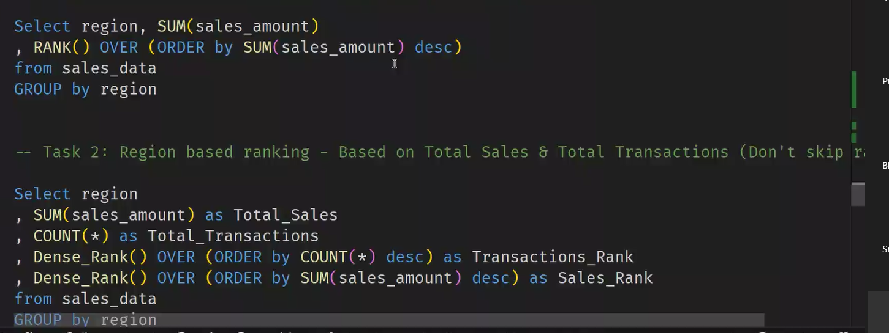

# Introduction to AWS

- It is a comprehensive cloud computing platform that includes infrastructure as a service and paas offerings.
- Paas:
  - it provides environment to deploy the app.
  - it will expect the source code from the user it has every resoruces asre ready based on the source code the paas will pre install the required sources.
  - it's like renting house.
- Iaas :
  - in this everything we needs to be installed.
    -from scratch everything we needs to install.
    -simply it is building a house from starting.
- Saas :

  - everything is present with source code user can use the application which is installed by them.

- Aws provides both paas,iaas.But there main service is iaas.
- S3 : simple storage service which helps to store the data provided by aws.
- Advantages:

  - stop gusseing capacity.
  - benefit from massive economies of scale-Scalability
  - pay as you go.
  - increase speed and agility.
    

- CDN: content delivery network
  - delivers the content from the nearby location i.e which comes faster
- cloudflare: main job is to protect from ddos attack and also provides cdn.

## Key Service Areas

- In amazon s3 it is a cheaper storage so less accessible data is stored.
- Amazon S3 can provide url for our websites. But for this lot of steps are done manually
- templates are not preinstall.

## Retreving of an image from s3

- first user will sent a request i.e put operation to the ec2 instance
- then the ec2 will verify's the user then using the node js it will write a query to update the profile picture.Then the link will be sent back to the ec2 from the database.
- Then the ec2 will fetch the image using the link.
- then the s3 will sent back the image to the ec2.
- 

## uploading the image in s3

-
- 

- Hosting : providing the place to do the task.
  - backend is running all the time for it cpu will computing all the time basically it sees the requests continusly.
- so for this webserver is used to contiusloy moniter the webpage.
- the web server will manage the static files i.e manages the traffic and helps to load.
  -
- node js will run on app server.
- if app crashes the the connections will be cutoff then to over come simply restart the app.for it we uses app server
  - ex:topcat,apache server.
- in amazon EBS we store o.s,tools,source code which helps to work the ec2. which are connected to eds.
- git install,source code ,os should be preinstalled and will we present in amazon EBS.
- Dynamo Db - it will store the documents
- Amazon EC2 will store the application and helps to run our application.
- Route 53 :resoloving of rounting which user should go where is said by amazon route 53.
  - It requries two things to create a domain name to work properly it needs i.p address and url of s3.
  - it will map the domain name to the ec2 .
  - the ip will map to the route 53
  - all records of user who can access which instance is present in route 53.
  - it will also give the mentioned name to the url.
- cold start : means takes time to start working. means if there are no requests then the system will shutdown and takes time to on the system.(turn on time+data retreival time)
- Aws lamda : it is a paas ,if there are zero people to request then the lamda will automatically shut down the laptop.(cold start)
  - lamda is useful for the more users.
  - not useful for the websites with less users.

## how to overcome cold start problem??

-

## AWS core infrastructure and services

- Amazon Route 53 - will verifys the user,naviagation to the users
- helps to manage the access to the users.
- security groups means creating groups in which common users access the resources.
- switch : its acts as an extension
- amazon vpc: virtual private connection - if we trying to connect the database from another router internet then we can't access the database because of this vpc.
- Elastic Load Balancing : dividing the load equally between the ec2's. it will also handles the edgecases.like how to split the load into the ec2's.
  

- -
- Nas- bunch of hardisk so that we can able to access the files even if the pc is off.
- 

## Three ways to interact with aws

- aws managemengt console
- aws command line interface(aws cli)
- software devlopments kit

## Authentication Vs Authorization

- who are you - authentication
- what you can do - authorization
-
