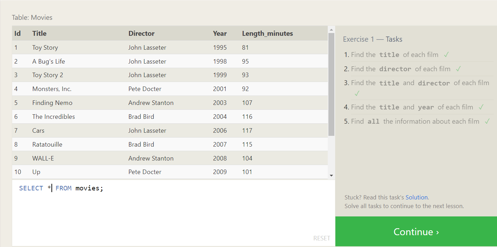
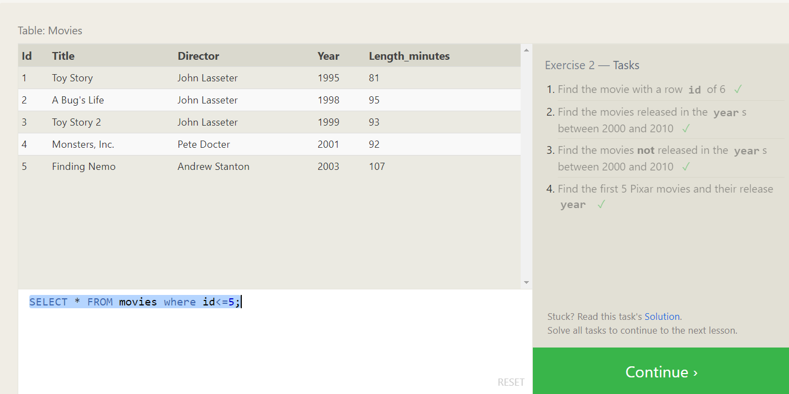
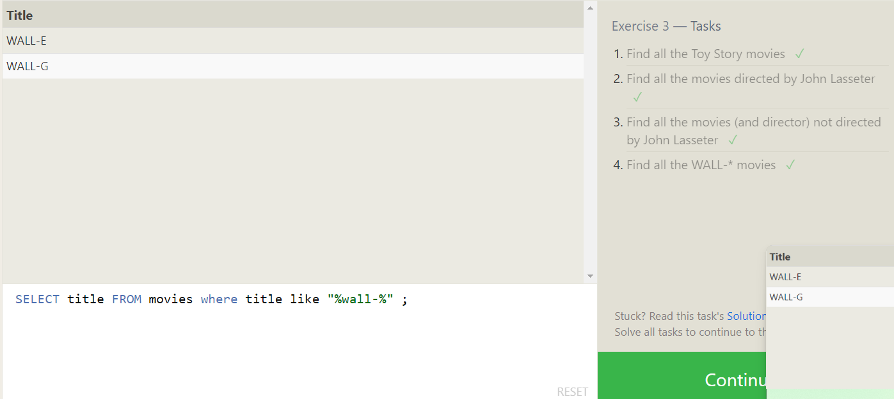
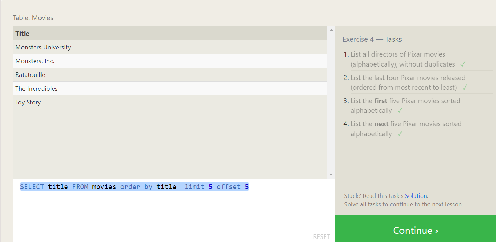

# Task-1

1. Find the title of each film

```sql
Select title from movies;
```

2. Find the director of each film

```sql
select director from movies;
```

3. Find the title and director of each film

```sql
select title,director from  movies;
```

4. Find the title and year of each film

```sql
select title,year from movies;
```

5. Find all the information about each film

```sql
select *from movies;
```



# Task-2

1. Find the movie with a row id of 6

```sql
SELECT * FROM movies where id=6;
```

2. Find the movies released in the years between 2000 and 2010

```sql
SELECT * FROM movies where year  between 2000 and 2010
```

3. Find the movies not released in the years not between 2000 and 2010

```sql
SELECT * FROM movies where year not  between 2000 and 2010
```

4.Find the first 5 Pixar movies and their release year

```sql
SELECT * FROM movies where id<=5;
```



# Task-3

1. Find all the Toy Story movies

```sql
SELECT title FROM movies where Title like "%toy%";
```

2. Find all the movies directed by John Lasseter

```sql
SELECT title FROM movies where director like "%john Lasseter%";
```

3. Find all the movies (and director) not directed by John Lasseter

```sql
SELECT title,director FROM movies where director not like "%john Lasseter%";
```

4. Find all the WALL-\* movies

```sql
SELECT title FROM movies where title like "%wall-%" ;
```



# Task-4

1. List all directors of Pixar movies (alphabetically), without duplicates

```sql
SELECT  DISTINCT director FROM movies  order by director;
```

2. List the last four Pixar movies released (ordered from most recent to least)

```sql
SELECT title FROM movies order by year desc limit 4 ;
```

3. List the first five Pixar movies sorted alphabetically

```sql
SELECT title FROM movies order by title  limit 5 ;
```

4. List the next five Pixar movies sorted alphabetically

```sql
SELECT title FROM movies order by title  limit 5 offset 5
```


